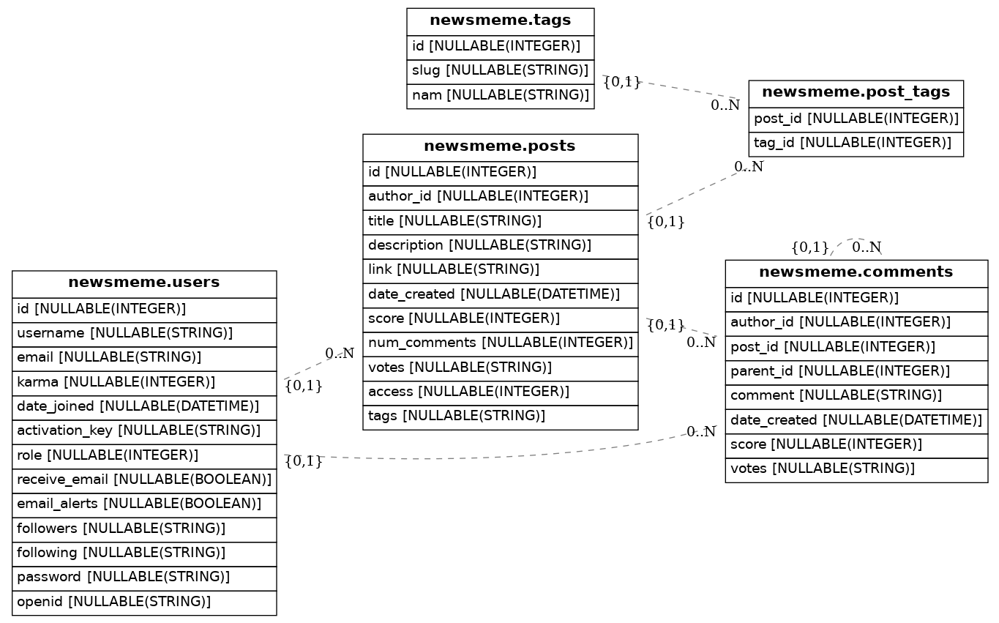

# bigquery-erd

Entity Relationship Diagram (ERD) Generator for Google BigQuery, based upon [eralchemy](https://github.com/Alexis-benoist/eralchemy).

## Examples

ERD for a NewsMeme database schema (taken from the original project).



## Installation

```sh
pip install bigquery-erd
```

`eralchemy` requires [GraphViz](http://www.graphviz.org/download) to generate the graphs and Python. Both are available for Windows, Mac and Linux.

## Usage

### Usage from Python

Find an example notebook [here](./notebooks/example.py).

## But Wait, BigQuey is not a Relation Database?

That's right. You cannot enforce primary or foreign key constraints in BigQuery. However, that doesn't mean that you should not be able to have logical dependencies between tables.

### Defining Relations through Column Descriptions

We use the column description field in BigQuery to define relations between columns in a format that we can later parse programmatically.

Let's assume we have a table `a` with a column `id` and another table `a` with a column `a_id` that serves as a foreign key relation to `a.id`.
We then add the following description to `b.a_id`:

```
-> b.id
```

### Defining Relations to Datasets Explicitly

Per default, we assume that the related tables are located inside the same dataset. However, you can also define the datasets explicitly. This is especially useful if the two related tables are not located within the same dataset.

Let's assume that table `a` is located in dataset `d1` and table `b` is located in `d2`.
The description in `b.a_id` would then be:

```
-> d1.a.id
```

### Defining Cardinality Explicitly

Cardinality defines the relationship between two tables. This package understands four different cardinalities:

- `*`, meaning "0..N"
- `?`, meaning "{0,1}"
- `+`, meaning "1..N"
- `1`, meaning "1"

Per default, we assume a cardinality of `*:1`. You can also define the relation's cardinality explicitly.

Let's assume that every record in `a` has at least 1 related record in `b`.
the description in `b.a_id` would be:

```
-> +:1 a.id
```

### Example

You can find a example Google BigQuery project for the NewsMeme schema with annotated descriptions [here](https://console.cloud.google.com/bigquery?project=test-project-jjagusch&p=test-project-jjagusch&d=newsmeme&page=dataset).

### Defining Custom Description RegEx

The default RegEx for relations in column descriptions is `->\s([?*+1 ]:[?*+1 ]\s)?(.*\.)?(.*)\.(.*)$`. You can define a custom RegEx by setting the `GBQ_RELATION_PATTERN` environment variable.
The RegEx should match four capture groups, where:

- The first group is the cardinality (which is optional)
- The second group is the dataset id (which is optional)
- The third group is the table id
- The fourth group is the column
